# 2. Előadás

## 1. Dia

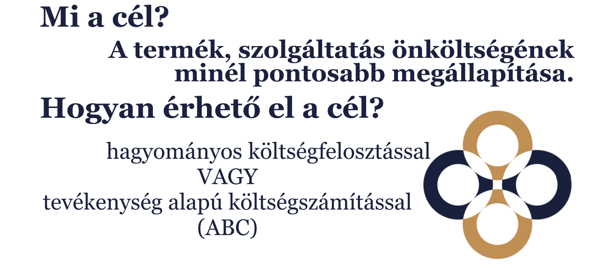

Hagyományos költségfelosztás és Activity Based Costing (ABC)

## 2. Dia

Üzemmérnökök értik a dolgokat, a könyvelők analfabéták.

## 3. Dia

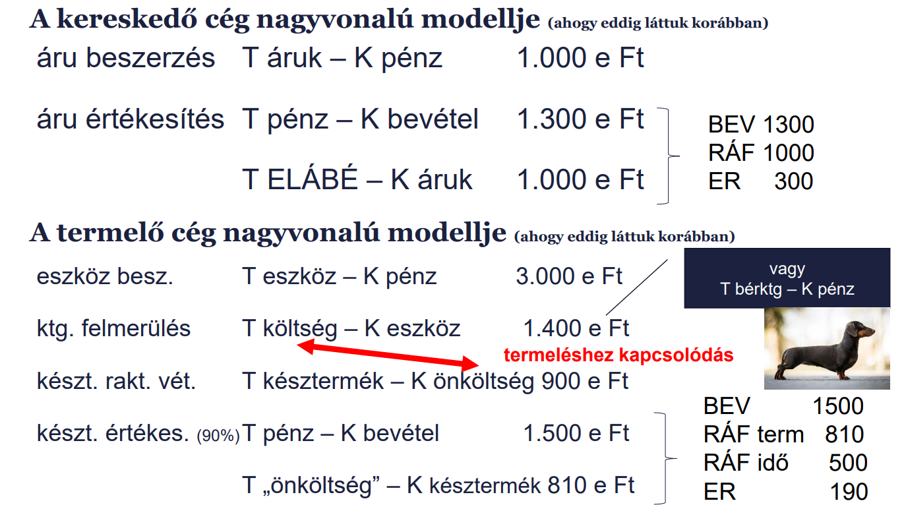

Probléma:

- Termelő gépet vett meg
- Amortizáció: Költségfelmerülés
- Késztermék raktárra vétele (úgy gondolják, hogy az önköltség 900e Ft)
- Eladják 1500e Ft-ért
- 900e 90%-a 810e Ft

1400 - 900 = 500e Ft ráfordítási idő

## 4. Dia

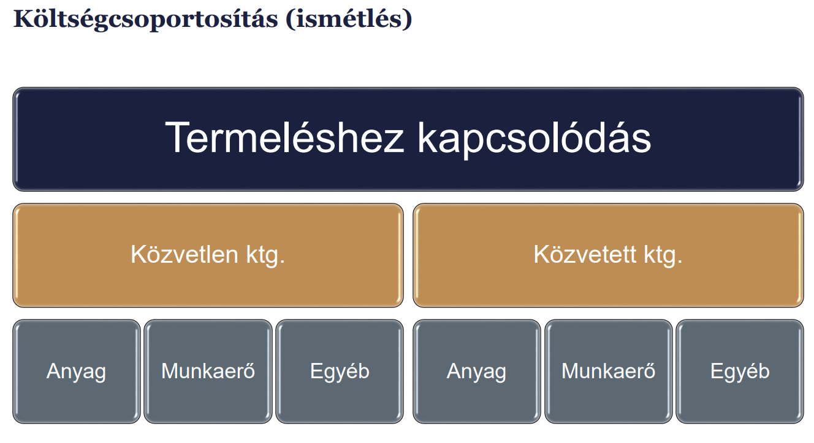

Kérdés: Hogyan lesz a közvetett költség felosztva a termékekre?

Közvetett költség lehet felosztható vagy fel nem osztható.

## 5. Dia

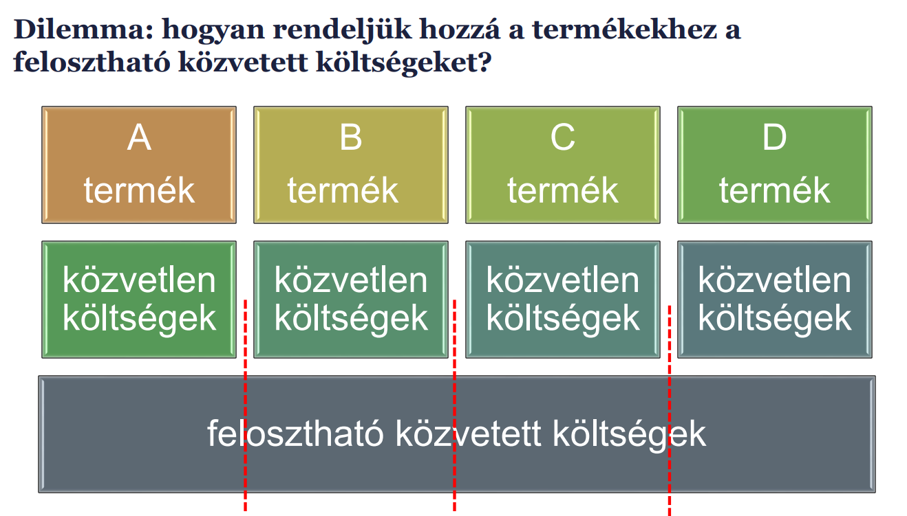

Felosztható közvetett költség:

Például lehet négy egyenlő részre vágni, és minden termékhez hozzárendelni.

## 6. Dia

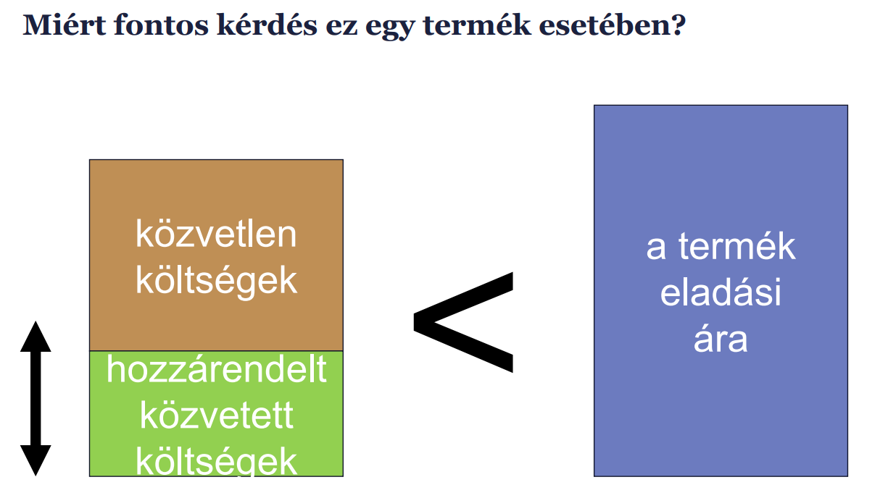

A cél, hogy a egy termék közvetlen költsége + hozzárendelt közvetett költség legyen kisebb, mint a termék eladási ára.

## 7. Dia

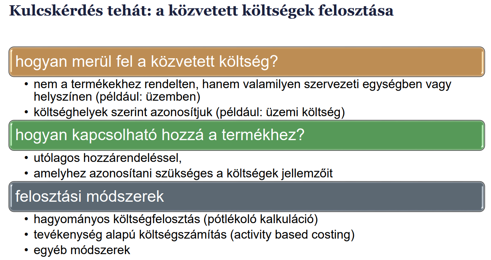

1. Először költség felmerülésének helyét megtalálni.
2. Utólagosan hozzárendelni a termékekhez a közvetett költségeket a költség jellemzése szerint.
3. Felosztási módszert kell választani.

## 8. Dia

A KÖLTSÉGEKET A TERMÉKÉK OKOZZÁK!!

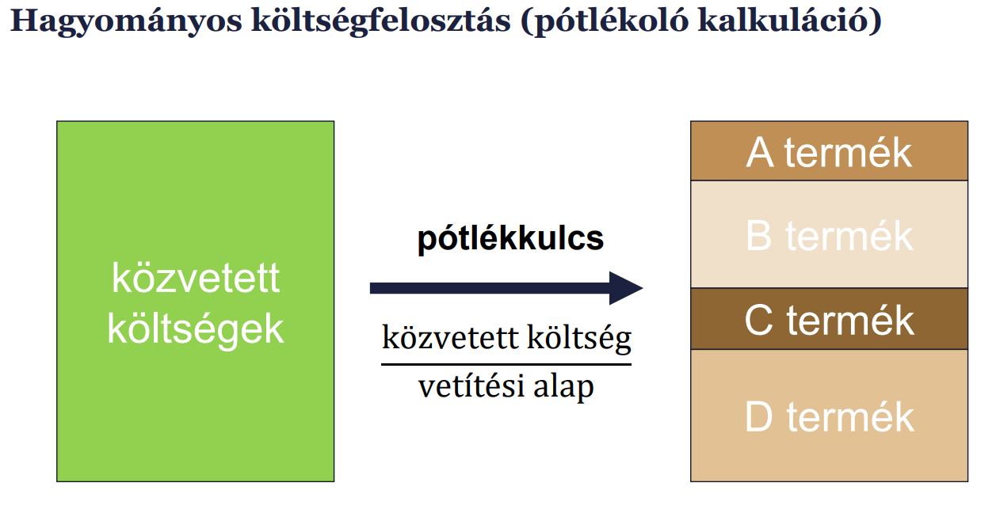

Folyamat:

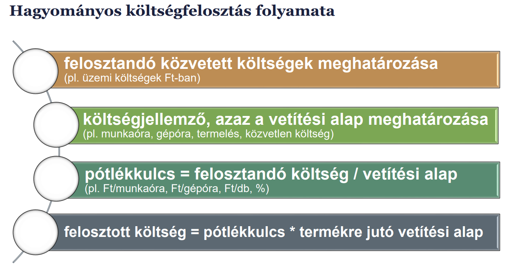

Lehet egyszintú vagy többszintű felosztás.
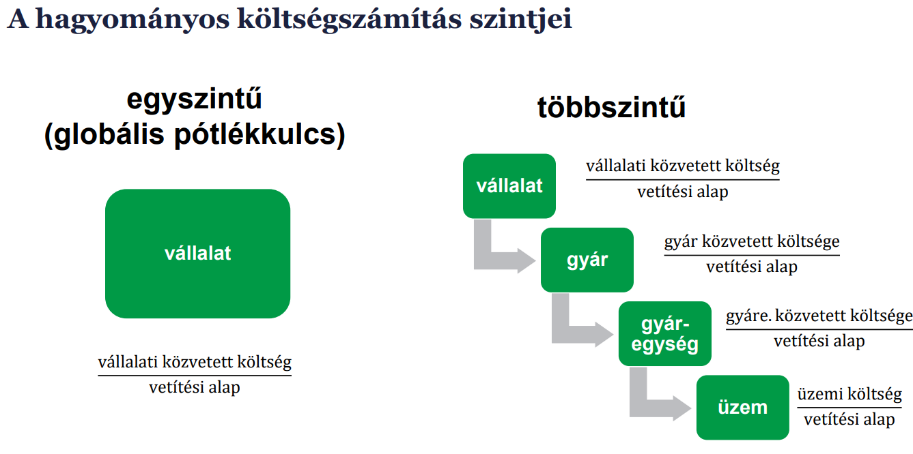

## 9. Dia

Tervezett vs tényleges pótlékkulcsok

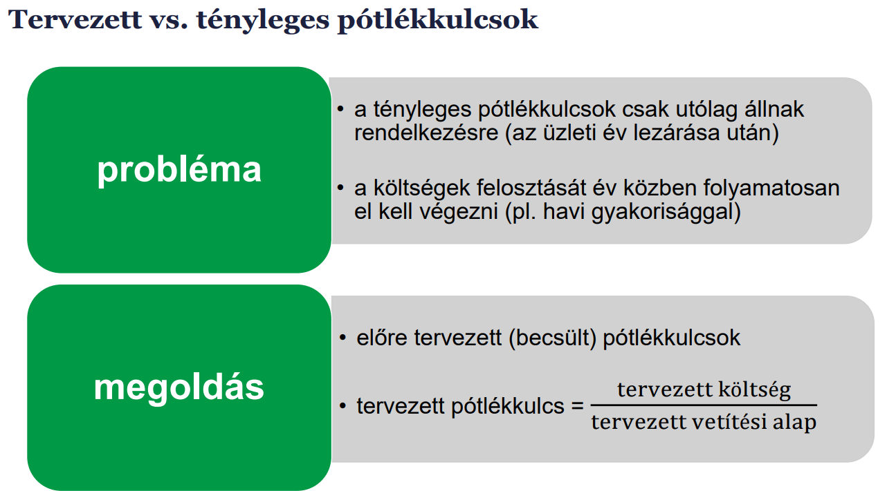

Mivel csak utólag derülnek ki a dolgok, ezért előre kell tervezni a pótlékkulcsokat.

## 10. Dia

Szolgáltató részlegek költségfelosztása

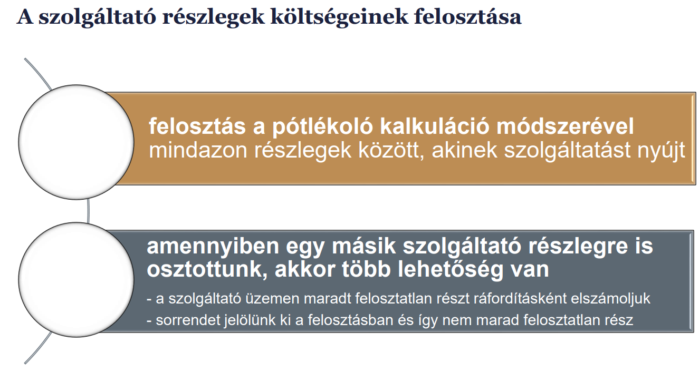

Ha a szolgáltatók egymásnak is szolgáltatnak, akkor a költségeket fel kell osztani egymás között is. Ez a visszacsatoló költségfelosztás.

## 11. Dia

Activity Based Costing (ABC)

**Alaptétel:**  
A költségeket a tevékenységek okozzák, a termékek ezeket a tevékenységeket használják fel.

Hagyományos: Erőforrások --> Termékek  
ABC: Erőforrások --> Tevékenységek --> Termékek

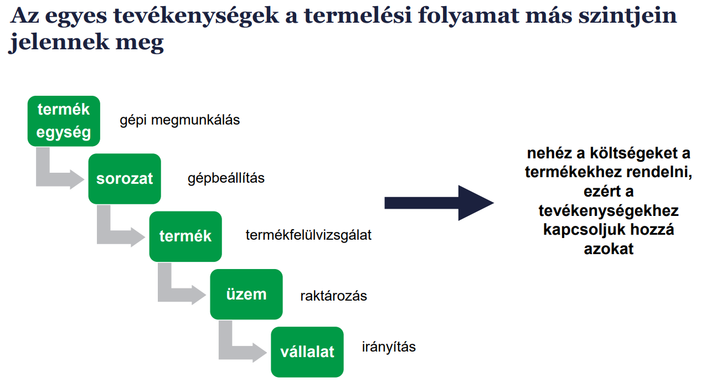

A költségeket tehát inkább tevékenységekhez rendelik.

Lépések:
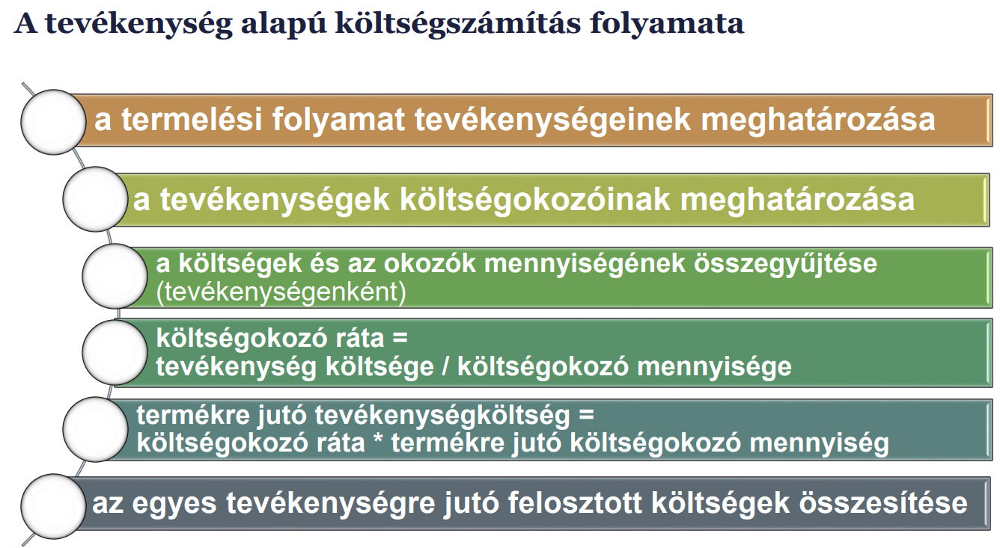

Hozzárendelés nem feltétlenül bijektív.

## 12. Dia

Összestve:

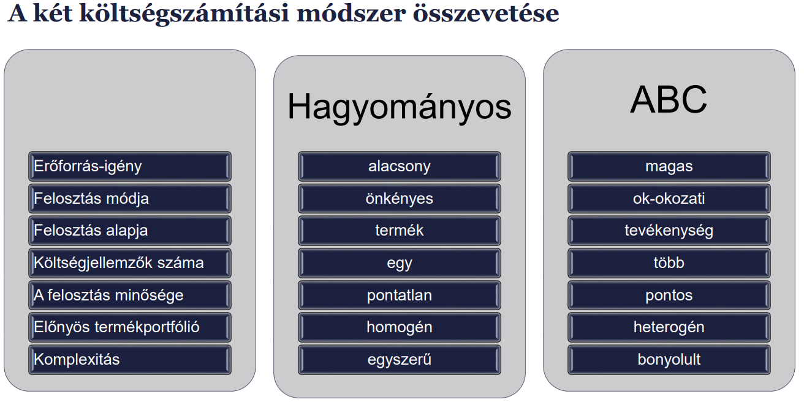
